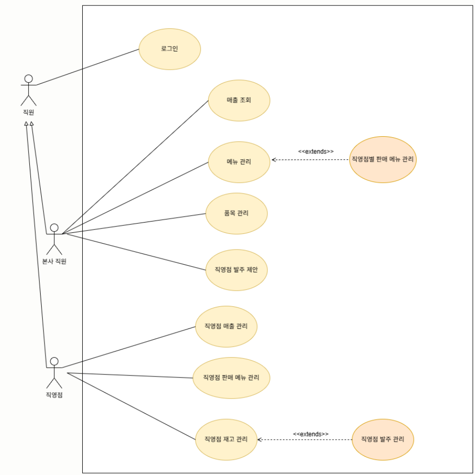
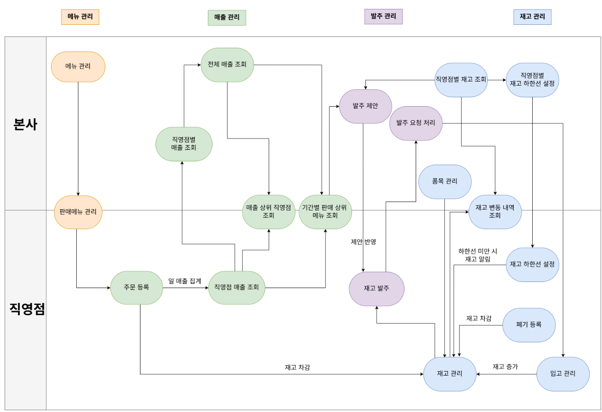
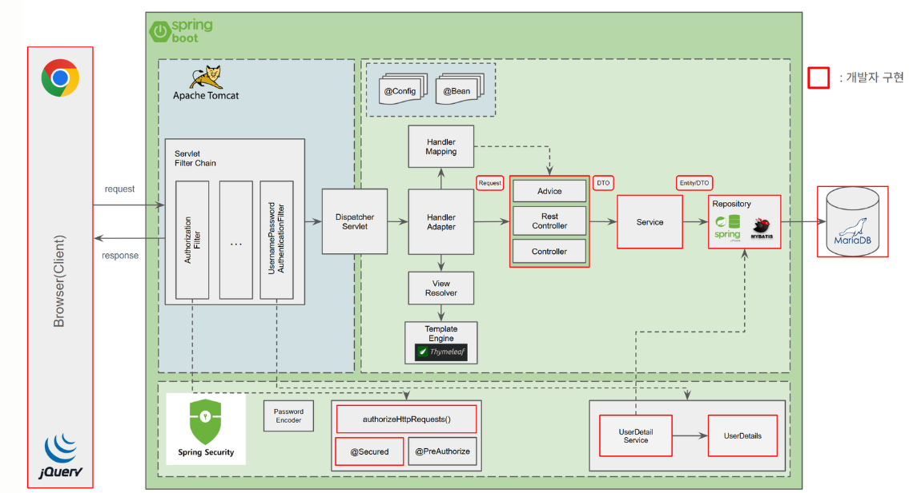
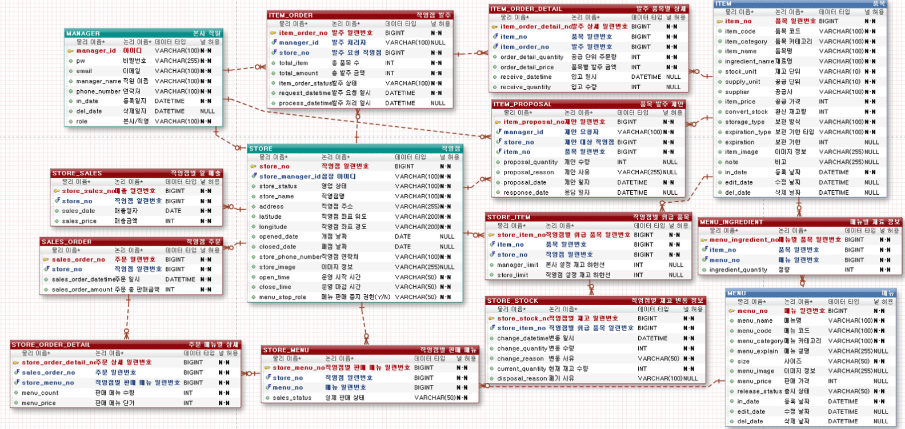
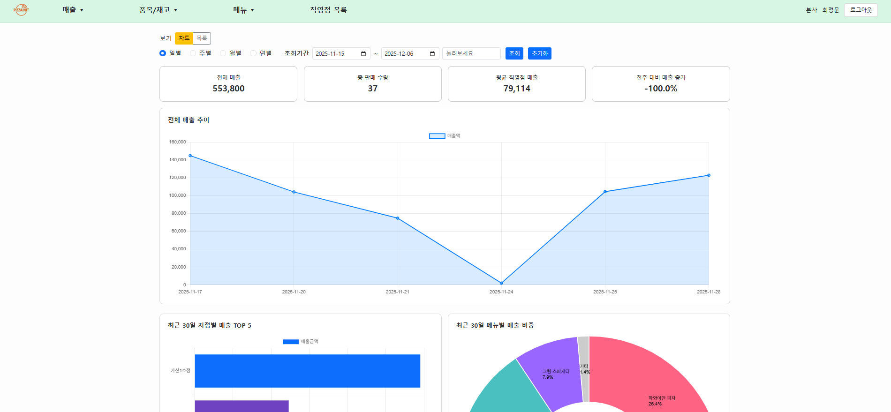
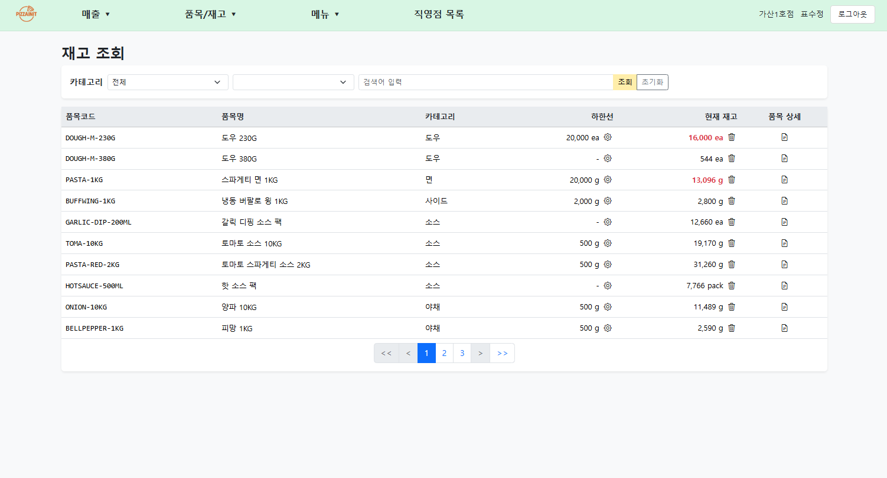
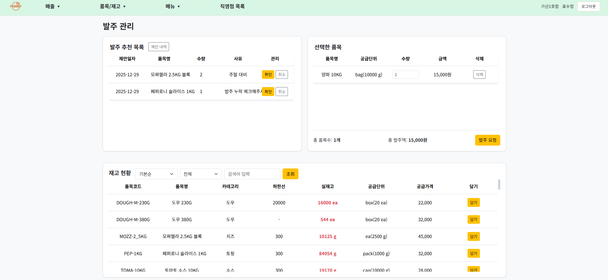
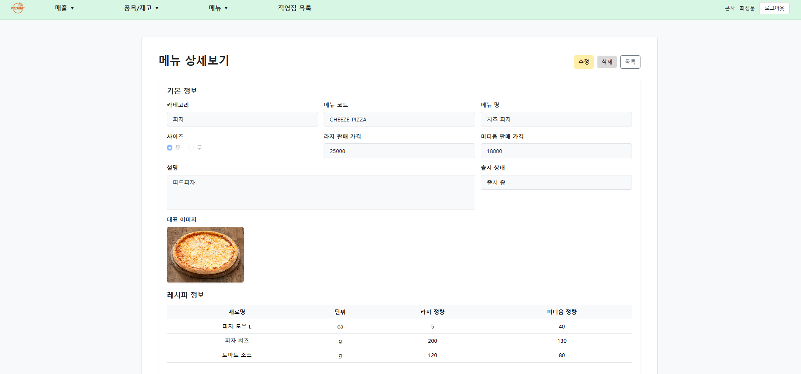

# Stock & Sales ERP - 재고·매출 관리 시스템

---

## 프로젝트 소개
- **기간**: 11/17 ~ 12/05 (15일)
- **형태**: Spring Boot MVC 기반 웹 ERP
- **주제**: 단일 브랜드 요식업 브랜드의 본사–직영점간 재고·매출 관리

- **팀구성**:
  **표수정(팀장)**: 일정 관리 / 메뉴 / 주문
  **배성윤**: PPT 관리 / 발주
  **문석현**: 상세 명세서 관리 / Security / 매출
  **최정문**: Git 관리 / 품목 / 재고
  **공통**: 요구사항 분석 설계, UI 설계, 모델링
---

## 페르소나
| 👤         | Pain Point                                              | 목표                                                                                       |
| ------------ | ------------------------------------------------------- | ---------------------------------------------------------------------------------------- |
| **본사 직원** | - 직영점별 재고·매출 현황을 실시간으로 파악하기 어려움 <br> - 매장에 비일관적인 조언·발주 제안 | - 직영점 데이터를 기반으로 재고·매출 통합 관리<br>- 매장에 직·간접적인 피드백을 시스템으로 표준화하고 자동화                         |
|**직영점**   | - 매출 분석 도구가 부족<br>- 재고가 증가/감소할 때마다 확인하고 입력하는 것이 비효율적임   | - 매출·재고 데이터와 본사 발주 제안을 기준으로 재고를 계획적으로 운영<br>- 발주/입고/판매/폐기에 따른 재고량 증감 자동화를 통해 누락·오입력을 최소화 |


## 벤치마킹
- eCount, GS ITM, Bizwell 등 ERP의 물류·품목·재고 관리 프로세스 참고
- 벤치마킹 포인트
    - 최소재고(하한선) 기반 경고/발주 추천
    - 발주–승인–입고–차감–폐기 재고 흐름
    - 레시피 연동형 재고 차감 로직
    - 직관적인 목록 UI, 필터·검색 방식
- 추가 아이디어
    - 본사가 직영점별로 재고, 매출에 대한 직접제안 +간접제안 기능
    - 제안 등록→검토→승인/거절  방식

---
## 컨셉모델(Usecase Diagram)

---
## Work Flow


---
## 기술 스택
- **Backend**: Spring Boot 3.5.7(Tomcat 10.1.48), Spring Security
- **Frontend**: Thymeleaf, jQuery, Bootstrap
- **Data Access**: MyBatis + Spring Data JPA
- **Database**: MariaDB
- **Infrastructure**: AWS EC2, S3
- **Testing**: JUnit 5, Postman
- **Tools**: IntelliJ IDEA, Lombok
- **Collaboration**: Git, GitHub, Jira, Figma
- **Language**: Java 17

---
## 아키텍처



---
## ERD


---


## 대표 화면

### 매출조회


### 재고관리


### 발주


### 메뉴상세



---


# Git 운영 원칙


## Branch Strategy & Commit Convention

## 1. Branch 구조

### main
- 배포용 브랜치
- 항상 안정된 코드만 존재
- 직접 커밋 금지
- develop → main merge만 허용

### develop
- 기능 통합 브랜치
- feature / fix / refactor 브랜치에서 작업 완료 후 merge
- 배포 전 최종 통합 코드 유지

### feature/*
- 기능 단위 개발 브랜치
- develop에서 분기
- UI, Controller, Service, Repository 등 기능 전체 코드 포함
- 테스트 코드도 feature 브랜치 내부에서 작성
- 기능 완료 후 develop으로 PR → merge 후 feature 브랜치 삭제

### fix/*
- 버그 수정 전용 브랜치
- develop에서 분기
- 버그 해결 후 develop에 merge → 브랜치 삭제

### refactor/*
- 기능 변화 없이 코드 구조 개선 전용 브랜치
- develop에 merge 후 삭제

### docs/*
- 문서 변경 전용 브랜치
- develop으로 merge 후 삭제


## 2. Branch Workflow

feature/*
fix/*
refactor/*
→ develop → main(배포)

- 기능 개발 → develop 통합 → main 배포


## 3. Commit Convention

형식:  
`type: description`  
영어, 명령형 사용 (예: add, fix, update…)

### Commit Types

- **feat** : 새로운 기능 추가
    - 예) `feat: add sales chart`

- **fix** : 버그 수정
    - 예) `fix: correct stock amount calc`

- **style** : UI/스타일 변경 (기능 영향 없음)
    - 예) `style: update table layout`

- **refactor** : 코드 구조 개선 (기능 변화 없음)
    - 예) `refactor: simplify service logic`

- **docs** : 문서 수정
    - 예) `docs: update ERD schema`

- **test** : 테스트 코드 추가/수정 (feature 브랜치 내부에서만 사용)
    - 예) `test: add item repository test`

- **delete** : 불필요 파일/코드 삭제
    - 예) `delete: remove unused dto`

- **revert** : 이전 커밋 되돌림
    - 예) `revert: undo wrong calculation`

- **wip** : 작업중 임시 커밋
    - 예) `wip: implement filter function`

- **merge** : 브랜치 병합 커밋
    - 예) `merge: feature/menu into develop`

---

## 참고 링크
```text
GitHub: https://github.com/j-pyohub/PIZZA_ERP_PROJECT
Figma:  https://www.figma.com/design/4U4Ian6Jk4kFq4mEZFrpHp/FOOD_BRAND_ERP_PROJECT?node-id=0-1&t=BgufdB7pBfiEuI3q-1
